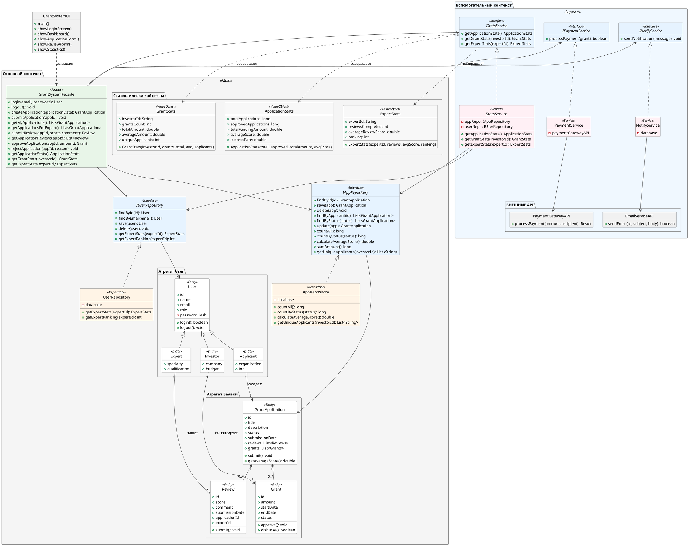

```plantuml
@startuml
skinparam class {
    BackgroundColor<<Interface>> #E6F3FF
    BackgroundColor<<Entity>> #FFFFFF
    BackgroundColor<<ValueObject>> #F8F8F8
    BackgroundColor<<Facade>> #E8F5E8
    BackgroundColor<<Repository>> #FFF4E6
    BackgroundColor<<Service>> #FFF0F5
    BorderColor #666666
    ArrowColor #444444
}

skinparam package {
    BackgroundColor<<Main>> #F5F5F5
    BackgroundColor<<Support>> #F0F8FF
    BorderColor #888888
}

class GrantSystemUI {
  + main()
  + showLoginScreen()
  + showDashboard()
  + showApplicationForm()
  + showReviewForm()
  + showStatistics()
}

package "Основной контекст" <<Main>> {

  class GrantSystemFacade <<Facade>> {
    + login(email, password): User
    + logout(): void
    + createApplication(applicationData): GrantApplication
    + submitApplication(appId): void
    + getMyApplications(): List<GrantApplication>
    + getApplicationsForExpert(): List<GrantApplication>
    + submitReview(appId, score, comment): Review
    + getApplicationReviews(appId): List<Review>
    + approveApplication(appId, amount): Grant
    + rejectApplication(appId, reason): void
    + getApplicationStats(): ApplicationStats
    + getGrantStats(investorId): GrantStats
    + getExpertStats(expertId): ExpertStats
  }

  interface IUserRepository <<Interface>> {
    + findById(id): User
    + findByEmail(email): User
    + save(user): User
    + delete(user): void
    + getExpertStats(expertId): ExpertStats
    + getExpertRanking(expertId): int
  }
  
  interface IAppRepository <<Interface>> {
    + findById(id): GrantApplication
    + save(app): GrantApplication
    + delete(app): void
    + findByApplicant(id): List<GrantApplication>
    + findByStatus(status): List<GrantApplication>
    + update(app): GrantApplication
    + countAll(): long
    + countByStatus(status): long
    + calculateAverageScore(): double
    + sumAmount(): long
    + getUniqueApplicants(investorId): List<String>
  }

  class UserRepository <<Repository>> implements IUserRepository {
    - database
    + getExpertStats(expertId): ExpertStats
    + getExpertRanking(expertId): int
  }
  
  class AppRepository <<Repository>> implements IAppRepository {
    - database
    + countAll(): long
    + countByStatus(status): long
    + calculateAverageScore(): double
    + getUniqueApplicants(investorId): List<String>
  }

  package "Агрегат User" {
    class User <<Entity>> {
      + id
      + name
      + email
      + role
      - passwordHash
      + login(): boolean
      + logout(): void
    }
    
    class Applicant <<Entity>> {
      + organization
      + inn
    }
    
    class Expert <<Entity>> {
      + specialty
      + qualification
    }
    
    class Investor <<Entity>> {
      + company
      + budget
    }
    
    User <|-- Applicant
    User <|-- Expert
    User <|-- Investor
  }


package "Агрегат Заявки" {
  class GrantApplication <<Entity>> {
      + id
      + title
      + description
      + status
      + submissionDate
      + submit(): void
      + reviews: List<Reviews>
      + grants: List<Grants>
      + getAverageScore(): double
   }

  class Review <<Entity>> {
      + id
      + score
      + comment
      + submissionDate
      + applicationId
      + expertId
      + submit(): void
   }

  class Grant <<Entity>> {
      + id
      + amount
      + startDate
      + endDate
      + status
      + approve(): void
      + disburse(): boolean
    }
}
  package "Статистические объекты" {
    class ApplicationStats <<ValueObject>> {
      + totalApplications: long
      + approvedApplications: long
      + totalFundingAmount: double
      + averageScore: double
      + successRate: double
      + ApplicationStats(total, approved, totalAmount, avgScore)
    }
    
    class ExpertStats <<ValueObject>> {
      + expertId: String
      + reviewsCompleted: int
      + averageReviewScore: double
      + ranking: int
      + ExpertStats(expertId, reviews, avgScore, ranking)
    }
    
    class GrantStats <<ValueObject>> {
      + investorId: String
      + grantsCount: int
      + totalAmount: double
      + averageAmount: double
      + uniqueApplicants: int
      + GrantStats(investorId, grants, total, avg, applicants)
    }
  }

  GrantSystemFacade --> IUserRepository
  GrantSystemFacade --> IAppRepository

  IUserRepository --> User
  IAppRepository --> GrantApplication
}

package "Вспомогательный контекст" <<Support>> {
  
  interface INotifyService <<Interface>> {
    + sendNotification(message): void
  }
  
  interface IPaymentService <<Interface>> {
    + processPayment(grant): boolean
  }

  interface IStatsService <<Interface>> {
    + getApplicationStats(): ApplicationStats
    + getGrantStats(investorId): GrantStats
    + getExpertStats(expertId): ExpertStats
  }

  class StatsService <<Service>> implements IStatsService {
    - appRepo: IAppRepository
    - userRepo: IUserRepository
    + getApplicationStats(): ApplicationStats
    + getGrantStats(investorId): GrantStats
    + getExpertStats(expertId): ExpertStats
  }
  
  class NotifyService <<Service>> implements INotifyService {
    - database
  }
  
  class PaymentService <<Service>> implements IPaymentService {
    - paymentGatewayAPI
  }

  package "ВНЕШНИЕ API" {
    class EmailServiceAPI {
      + sendEmail(to, subject, body): boolean
    }
  
    class PaymentGatewayAPI {
      + processPayment(amount, recipient): Result
    }
  }

  NotifyService --> EmailServiceAPI
  PaymentService --> PaymentGatewayAPI
  StatsService --> IAppRepository
  StatsService --> IUserRepository
}

GrantSystemUI ..> GrantSystemFacade : вызывает

GrantSystemFacade --> INotifyService
GrantSystemFacade --> IPaymentService
GrantSystemFacade --> IStatsService

Applicant "1" --> "*" GrantApplication : создает
Expert "1" --> "*" Review : пишет
Investor "1" --> "*" Grant : финансирует
GrantApplication "1" *-- "0..*" Review
GrantApplication "1" *-- "0..*" Grant 

IStatsService ..> ApplicationStats : возвращает
IStatsService ..> ExpertStats : возвращает
IStatsService ..> GrantStats : возвращает

hide empty members
hide circle
@enduml
```
