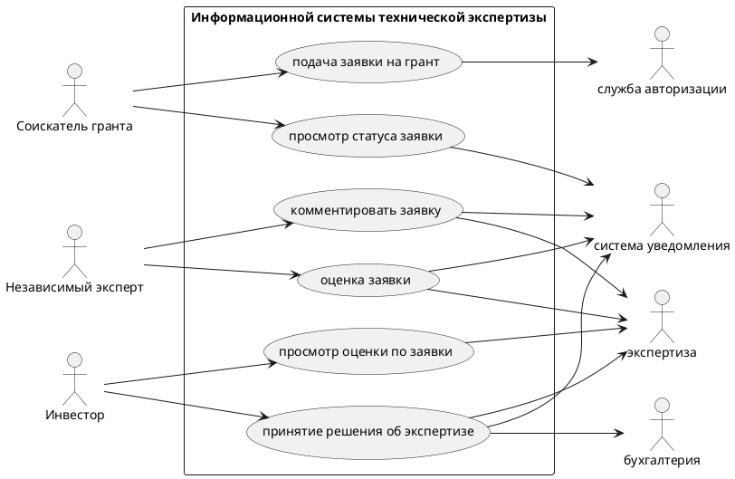

# Диаграмма прецедентов "Информационной системы технической экспертизы"

```plantuml
@startuml
skinparam packageStyle rect
left to right direction

:Соискатель гранта:
:Независимый эксперт:
:Инвестор:

package "Информационной системы технической экспертизы" {
    (подача заявки на грант)
    (оценка заявки)
    (комментировать заявку)
    (принятие решения об экспертизе)
    (просмотр статуса заявки)
    (просмотр оценки по заявки)
}

:Соискатель гранта: --> (подача заявки на грант)
:Соискатель гранта: --> (просмотр статуса заявки)

:Независимый эксперт: --> (оценка заявки)
:Независимый эксперт: --> (комментировать заявку)

:Инвестор: --> (принятие решения об экспертизе)
:Инвестор: --> (просмотр оценки по заявки)

:служба авторизации:
:экспертиза:
:система уведомления:
:бухгалтерия:

(подача заявки на грант) --> :служба авторизации:
(оценка заявки) --> :экспертиза:
(оценка заявки) --> :система уведомления:

(просмотр статуса заявки) --> :система уведомления:

(принятие решения об экспертизе) --> :система уведомления:
(принятие решения об экспертизе) --> :бухгалтерия:
(принятие решения об экспертизе) --> :экспертиза:

(комментировать заявку) --> :система уведомления:
(комментировать заявку) --> :экспертиза:

(просмотр оценки по заявки) --> :экспертиза:
@enduml
```
